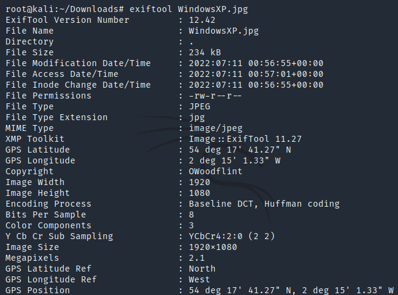
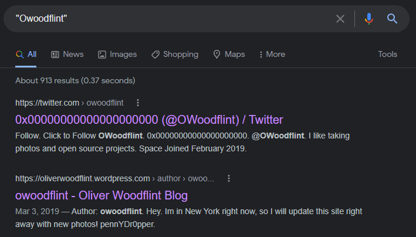
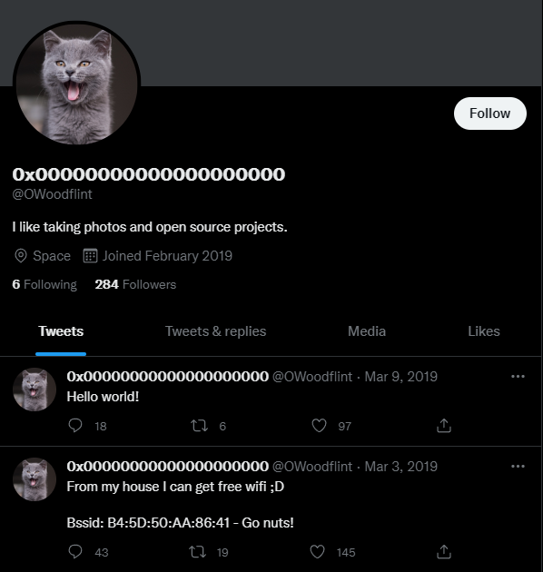
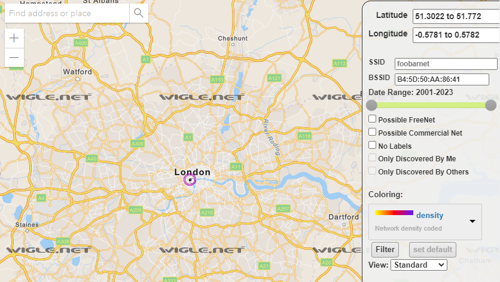
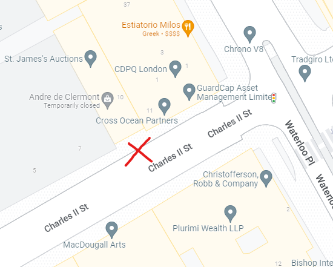
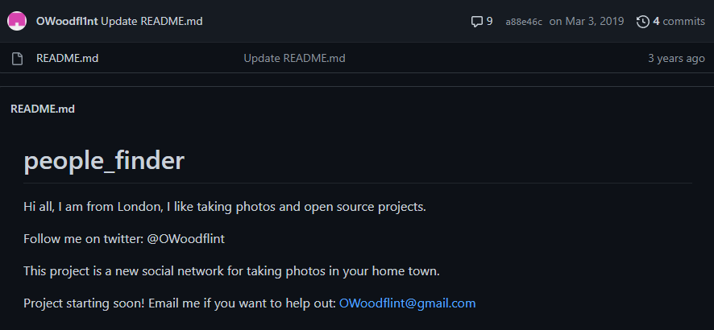
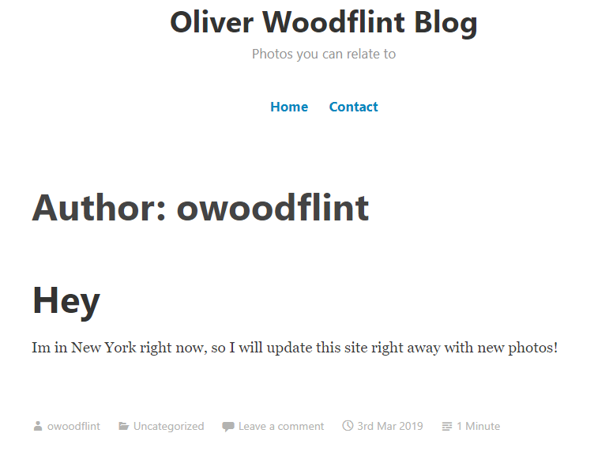
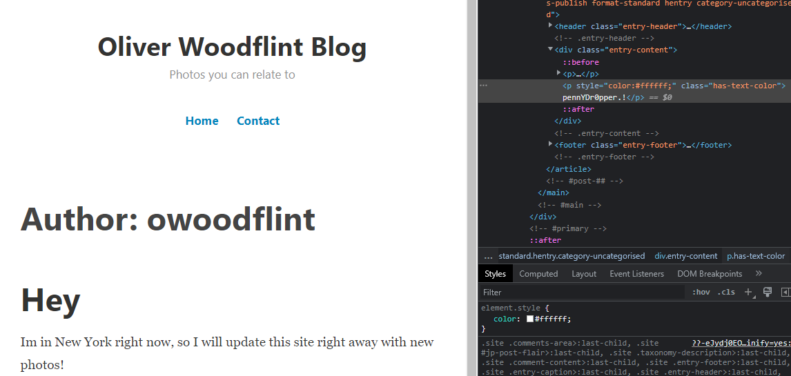
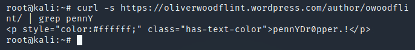

# TryHackMe OhSINT Challenge
What information can you possible get with just one photo?

First, we can observe the metadata in the .jpg image above by using _exiftool_. Run the following command in Kali Linux to install exiftool:

`sudo apt install exiftool`

Once exiftool has been installed, run the following command to retrieve the metadata from the .jpg image:

`exiftool WndowsXP.jpj`

Under the Copyright results, we see the creator of this image is assocaited with OWoodflint. Let's give this a Google search with quotations around the name:

A few search results show up for OWoodflint, specifically a Twitter account, Github, and WordPress site. Let's start with the [Twitter page](https://twitter.com/owoodflint) associated with OWoodflint. This profile was created in February 2019 and only had 2 tweets. The profile picture of this account is of a *cat*.

One tweet lists a BSSID for a "free wifi" network `B4:5D:50:AA:86:41`. Let's look up this BSSID WiFi Network using `https://www.wigle.net/`. The name of the WiFi Network is `UnileverWifi`.

By using Wigle, we find that OWoodflint is using a WiFi network that is located in Downtown *London*. If we search for the intersection of Charles II Street and Waterloo Place on Google Maps, we can then locate the WiFi Network location. 

Next, let's look at the [Github page](https://github.com/OWoodfl1nt/people_finder) we found on OWoodflint. We find his email address as `OWoodflint@gmail.com` and his Twitter account as `@OWoodflint`. We can also confirm his location of London matches the information we found from the Twitter account. 

Finally, let's take a look at the [WordPress site](https://oliverwoodflint.wordpress.com/author/owoodflint/) created under OWoodflint. We can see that the blog belongs to a person named `Oliver Woodflint` based on the domain name. Oliver mentions he is in New York for the Holidays. 

Upon inspecting the page, we find Oliver Woodflint's password in plaintext as an HTML element: `pennYDr0pper.!`

You can also find the password in the HTML code by using a curl command, followed by a grep command:

By inspecting metadata from a .jpg image, and conducting passive reconnaisance using open-source intelligence tools, we were able to amass confidential information around Oliver Woodflint's accounts, including his WiFi Network, geo-location, name, email address, password, and more. This challenge was done through TryHackMe.com.
